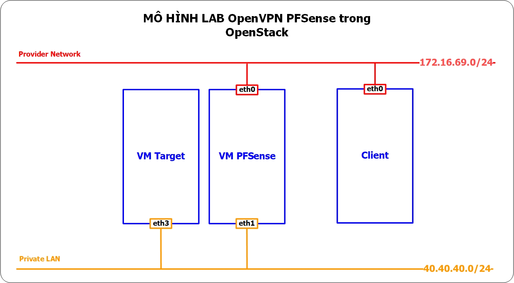

## Hướng dẫn sử dụng PFSense để cung cấp dịch vụ VPN trong OpenStack

### Mục tiêu LAB
- Mô hình này sử dụng 2 máy ảo trong OpenStack (cùng tenant), trong đó:
  - VM PFsense cài đặt PFsense.
  - VM Client
Bài lab thành công khi máy remote quay VPN thành công và ping được tới dải VM Client (dải Private) trong tenant.

## Mô hình 
- Sử dụng mô hình dưới để cài đặt


## IP Planning
- Phân hoạch IP cho các máy chủ trong mô hình trên


## Chuẩn bị và môi trường LAB
- Máy remote: OS Ubunu 14.04
- Máy Client: OS Ubuntu 14.04
- Máy PFSense: tham khảo hướng dẫn cài đặt ở 
 

## Thực hiện trên PFSense
Cài đặt OpenVPN mode TUN theo hướng dẫn ở 
 

## Thực hiện trên host Controller của OpenStack
  - Lấy thông tin id port của VM PFsense thưộc VLAN Private (IP: 40.40.40.2)
  ```sh
  neutron port-list | grep 40.40.40.2
  ```
  Kết quả:
  ```sh
  | 97282f6a-17ff-4e4b-b53f-27756efda9f7 |      | fa:16:3e:fe:09:26 | {"subnet_id": "08cf18ff-66c4-489a-b857-1f2d01fbb043", "ip_address": "40.40.40.2"}    |
  ```

  - Cho phép nhiều VLAN được đi qua port này
  ```sh
  neutron port-update 97282f6a-17ff-4e4b-b53f-27756efda9f7 --allowed-address-pairs list=true type=dict ip_address=0.0.0.0/0
  ```
  Kết quả: 
  ```sh
  Updated port: 97282f6a-17ff-4e4b-b53f-27756efda9f
  ```

  - Kiểm tra thông tin port
  ```sh
  neutron port-show 97282f6a-17ff-4e4b-b53f-27756efda9f7
  ```
  Kết quả:
  ```sh
  +-----------------------+-----------------------------------------------------------------------------------+
| Field                 | Value                                                                             |
+-----------------------+-----------------------------------------------------------------------------------+
| admin_state_up        | True                                                                              |
| allowed_address_pairs | {"ip_address": "0.0.0.0/0", "mac_address": "fa:16:3e:fe:09:26"}                   |
| binding:host_id       | compute1                                                                          |
| binding:profile       | {}                                                                                |
| binding:vif_details   | {"port_filter": true}                                                             |
| binding:vif_type      | bridge                                                                            |
| binding:vnic_type     | normal                                                                            |
| created_at            | 2017-12-02T17:07:59                                                               |
| description           |                                                                                   |
| device_id             | 0486a597-515d-4ed5-8ac7-42842113f60c                                              |
| device_owner          | compute:nova                                                                      |
| extra_dhcp_opts       |                                                                                   |
| fixed_ips             | {"subnet_id": "08cf18ff-66c4-489a-b857-1f2d01fbb043", "ip_address": "40.40.40.2"} |
| id                    | 97282f6a-17ff-4e4b-b53f-27756efda9f7                                              |
| mac_address           | fa:16:3e:fe:09:26                                                                 |
| name                  |                                                                                   |
| network_id            | d6acedb1-06e6-44aa-9aa3-5d1b64bb0f33                                              |
| port_security_enabled | True                                                                              |
| security_groups       | 8a7f2519-8bfa-4b11-a29e-b22fdfec18ce                                              |
| status                | ACTIVE                                                                            |
| tenant_id             | cc53359b83b0435397235399f144948a                                                  |
| updated_at            | 2017-12-11T10:05:57                                                               |
+-----------------------+-----------------------------------------------------------------------------------+
```

## Thực hiện trên host Remote, kết nối VPN
  - Trên host Remote, cài đặt OpenVPN
    ```sh
    apt-get update -y
    appt-get install openvpn
    ```

  - Giải nén gói cấu hình OpenVPN download từ PFsense vào thư mục /etc/openvpn
  	```sh
  	apt-get install unzip -y
  	unzip pfSense-UDP4-1195-client1-config.zip -d /etc/openvpn
  	```

  - Move các file key vào 1 thư mục riêng
  	```sh
  	cd /etc/openvpn
  	mkdir pfSense-UDP4-1195-client1
  	mv pfSense-UDP4-1195-client1.p12 pfSense-UDP4-1195-client1-tls.key pfSense-UDP4-1195-client1
  	```

  - Đổi tên file
  	```sh
  	cd /etc/openvpn
  	mv pfSense-UDP4-1195-client1.ovpn pfsense.conf
  	```

  - Chỉnh sửa lại file pfsense.conf như sau
  	```sh
  	dev tun
	persist-tun
	persist-key
	cipher AES-128-CBC
	auth SHA1
	tls-client
	client
	resolv-retry infinite
	remote ip_provider_pfsense 1195
	proto udp
	verify-x509-name "server-cert" name
	auth-user-pass /etc/openvpn/pfSense-UDP4-1195-client1/pass
	pkcs12 /etc/openvpn/pfSense-UDP4-1195-client1/pfSense-UDP4-1195-client1.p12
	tls-auth /etc/openvpn/pfSense-UDP4-1195-client1/pfSense-UDP4-1195-client1-tls.key 1
	remote-cert-tls server
	```	

  - Tạo file /etc/openvpn/pfSense-UDP4-1195-client1/pass để chứa username và password của user
  	```sh
  	client1
	password
  	```

  - Kết nối VPN
  	```sh
  	openvpn --config pfsense.conf
  	```

  - Kiểm tra bằng lệnh `ip a`, host đã nhận IP của Tunnel
  	```sh
  	22: tun0: <POINTOPOINT,MULTICAST,NOARP,UP,LOWER_UP> mtu 1500 qdisc pfifo_fast state UNKNOWN group default qlen 100
    link/none 
    inet 10.8.3.2/24 brd 10.8.3.255 scope global tun0
       valid_lft forever preferred_lft forever
  	```

  - Kiểm tra ping vào dải mạng 40.40.40.0/24
  	```sh
  	ping 40.40.40.2
  	```


Tham khảo:

[1] - http://superuser.openstack.org/articles/managing-port-level-security-openstack/

[2] - https://dev.cloudwatt.com/en/blog/openvpn-in-a-vm-running-in-an-opencontrail-subnet.html
